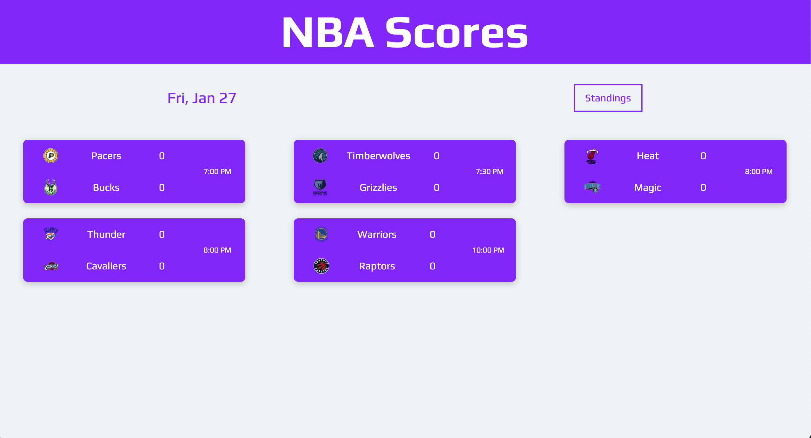

# NBA SCORES AND STATS

## Concept

This web app retrieves all NBA games on the current day and displays the the teams playing, their scores, and the status of the game (i.e. 1st quarter etc). In addition, on hovering over each game, the highest scoring players for each team are listed.

Link to live [site](https://nba-games.netlify.app/).

 

 

## Technologies Used

This project was built using React and vanilla CSS.

The API I used is called BallDontLie, which is found [here](https://www.balldontlie.io/#introduction). It updates roughly every ten minutes.

 

## Future improvements

- I have built several web scraping tools to add more features to the site that cannot be provided by the BallIsLife API. I will be implementing those features soon. These are the scraping tools I have built so far:

  1. [Individual Scoring Leaders](https://github.com/davepaulsanders/nba-leaders)
  2. [Standings](https://github.com/davepaulsanders/nba-standings-scraper)
